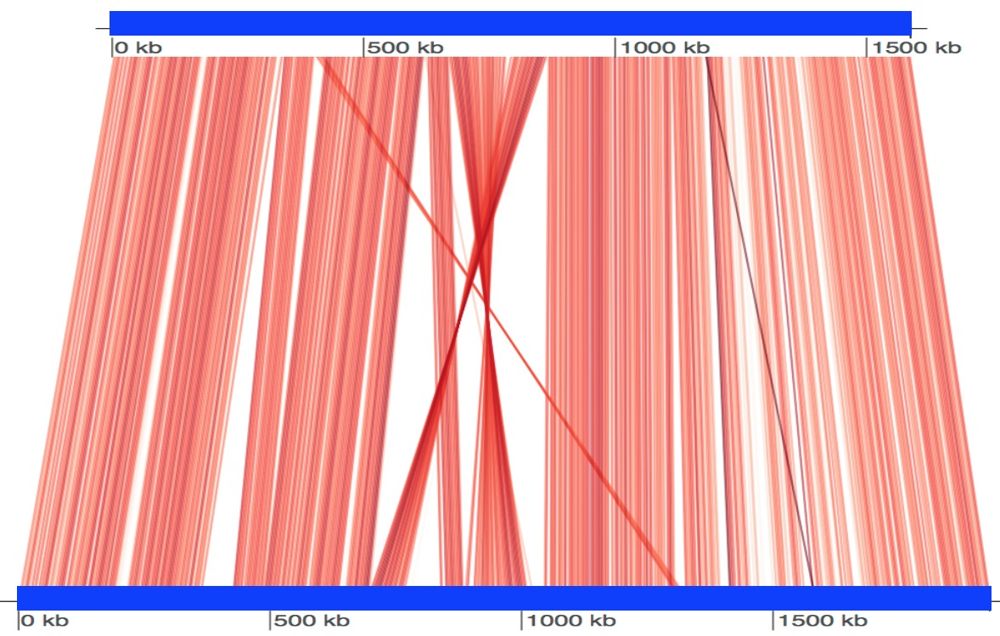

# FastANI

[](LICENSE)
[](https://anaconda.org/bioconda/fastani)
[](https://github.com/ParBLiSS/FastANI/releases)
[](https://codecov.io/gh/srirampc/FastANI)

FastANI is a tool for fast, alignment-free computation of whole-genome Average Nucleotide Identity (ANI). ANI is commonly used to quantify similarity between microbial genomes. FastANI supports both complete and draft assemblies and is designed for high-throughput genome comparison workloads.

The method follows the same general ANI workflow described by [Goris et al. 2007](http://www.ncbi.nlm.nih.gov/pubmed/17220447), but avoids expensive full-sequence alignments and instead uses [Mashmap](https://github.com/marbl/MashMap) as the MinHash-based mapping engine. More details on the method, accuracy, and large-scale applications are described in "[High Throughput ANI Analysis of 90K Prokaryotic Genomes Reveals Clear Species Boundaries](https://doi.org/10.1038/s41467-018-07641-9)".

## Start here

- [Install FastANI](INSTALL.txt)
- [Quick start](#quick-start)
- [Choose a workflow](#choose-a-workflow)
- [Reference guide](#reference-guide)
- [Input options](#input-options)
- [Output options](#output-options)
- [Mapping parameters](#mapping-parameters)
- [Execution options](#execution-options)
- [Troubleshooting](#troubleshooting)

## Installation

Clone the repository and follow [`INSTALL.txt`](INSTALL.txt) to build the project.

Prebuilt dependency-free binaries for Linux and macOS are also available from the [releases page](https://github.com/ParBliSS/FastANI/releases).

After installation, the executable is available as `fastANI`.
If you are running directly from the build tree without installing, use `build/fastANI`.

By default, `Release` builds favor portability across machines. For local benchmarking on a known host, you can opt into host-specific tuning with `-DFASTANI_NATIVE_OPTIMIZATION=ON`.

## Quick start

```sh
# View help and version information.
fastANI --help
fastANI --version

# Compute ANI for a single query genome against a single reference genome.
fastANI -q QUERY_GENOME -r REFERENCE_GENOME -o output.txt

# Compute ANI for a single query genome against many references.
fastANI -q QUERY_GENOME --refList references.txt -o output.txt

# Compute ANI for many queries against many references.
fastANI --queryList queries.txt --refList references.txt -o output.txt
```

## Choose a workflow

Use plain query/reference inputs when:

- you are running one-off analyses
- you do not plan to reuse the same reference database repeatedly
- you want FastANI to rebuild reference data directly from the supplied FASTA/FASTQ inputs

Use sketch-backed workflows when:

- you will query the same reference set repeatedly
- reference build time matters
- you want explicit control over RAM usage with `--batch-size`

```sh
# 1 vs 1
fastANI -q query.fa -r reference.fa -o output.txt

# 1 vs 1 with extended metrics
fastANI -q query.fa -r reference.fa --extended-metrics -o output.txt

# 1 vs many
fastANI -q query.fa --refList references.txt -o output.txt

# many vs many
fastANI --queryList queries.txt --refList references.txt -o output.txt

# many vs many with matrix output
fastANI --queryList queries.txt --refList references.txt --matrix -o output.txt

# many vs many with one sparse row per reciprocal genome pair
fastANI --queryList queries.txt --refList references.txt --average-reciprocals --header -o output.txt
```

## Reference guide

### Input options

| Parameter           | Default | Description                                                                         | Typical use                                               |
| ------------------- | ------- | ----------------------------------------------------------------------------------- | --------------------------------------------------------- |
| `-q, --query`       | `null`  | Single query genome in FASTA/FASTQ format, optionally gzip-compressed.              | Use for 1 vs 1 or 1 vs many runs.                         |
| `-r, --ref`         | `null`  | Single reference genome in FASTA/FASTQ format, optionally gzip-compressed.          | Use for simple pairwise runs.                             |
| `--ql, --queryList` | `null`  | Text file listing query genome paths, one genome per line.                          | Use for many-query runs.                                  |
| `--rl, --refList`   | `null`  | Text file listing reference genome paths, one genome per line.                      | Use for many-reference runs or sketch creation.           |
| `--sketch`          | `null`  | Load a previously written reference sketch prefix instead of rebuilding references. | Use for repeated querying against the same reference set. |

<details>
<summary>Example: create a line-separated reference list</summary>

<pre><code class="language-sh">find references/ -type f \( -name '*.fa' -o -name '*.fna' -o -name '*.fasta' -o -name '*.fa.gz' -o -name '*.fna.gz' -o -name '*.fasta.gz' \) | sort &gt; references.txt</code></pre>

</details>

> If genome lists are copied or created from a Windows application, run `dos2unix` on the list file first to ensure the expected line-ending format.

> FastANI warns on exact duplicate query or reference paths in list-based runs. During `--write-ref-sketch`, it also warns on potentially identical reference inputs using a lightweight content-derived key.

### Output options

| Parameter               | Default  | Description                                                                                                                                                                                                                                                                                                                               | Typical use                                                                                |
| ----------------------- | -------- | ----------------------------------------------------------------------------------------------------------------------------------------------------------------------------------------------------------------------------------------------------------------------------------------------------------------------------------------- | ------------------------------------------------------------------------------------------ |
| `-o, --output`          | `stdout` | Write the main tabular ANI results to this file. If omitted, the main tabular output is written to standard output.                                                                                                                                                                                                                       | Use `-o` when you want a file on disk; omit it when piping results to another tool.        |
| `--write-ref-sketch`    | `false`  | Write a reference sketch database and exit. Requires `--ref` or `--refList`.                                                                                                                                                                                                                                                              | Use before repeated sketch-backed querying.                                                |
| `--matrix`              | `false`  | Also write ANI values to `<output>.matrix` as a lower-triangular [PHYLIP-style matrix](https://www.mothur.org/wiki/Phylip-formatted_distance_matrix).                                                                                                                                                                                     | Use for all-vs-all matrix-style analyses.                                                  |
| `--average-reciprocals` | `false`  | Average ANI and the extended fragment-level ANI summary metrics across reciprocal rows in the main tabular output only. The emitted row keeps a deterministic query/reference orientation, while `MatchedFragments`, `TotalQueryFragments`, `QueryAlignmentFraction`, and `ReferenceAlignmentFraction` remain tied to that displayed row. | Use when you want one sparse row per reciprocal genome pair without relying on `--matrix`. |
| `--visualize`           | `false`  | Also write fragment mappings to `<output>.visual` for each reported query/reference comparison.                                                                                                                                                                                                                                           | Use when plotting conserved regions for selected genome pairs.                             |
| `--extended-metrics`    | `false`  | Report additional fragment-level ANI summary fields in the main tabular output only, including query/reference alignment fractions and fragment-level ANI distribution summaries.                                                                                                                                                         | Use when you want more detailed fragment summary fields.                                   |
| `--header`              | `false`  | Write a header row in the main tabular output only; it does not change `.matrix` or `.visual` sidecar files.                                                                                                                                                                                                                              | Use for easier downstream parsing.                                                         |

The main output is a tab-delimited file. Each row reports:

| Field                        | Description                                                                                                                                                                                                               |
| ---------------------------- | ------------------------------------------------------------------------------------------------------------------------------------------------------------------------------------------------------------------------- |
| Query                        | Query genome path or identifier                                                                                                                                                                                           |
| Reference                    | Reference genome path or identifier                                                                                                                                                                                       |
| ANI                          | Estimated average nucleotide identity between the genome pair; primary whole-genome similarity summary                                                                                                                    |
| MatchedFragments             | Number of bidirectional fragment mappings supporting the ANI estimate                                                                                                                                                     |
| TotalQueryFragments          | Total number of query fragments considered for the comparison                                                                                                                                                             |
| QueryAlignmentFraction\*     | Fraction of query fragments that participate in bidirectional mappings (`MatchedFragments / TotalQueryFragments`); useful for judging whether ANI is supported across enough of the query genome                          |
| ReferenceAlignmentFraction\* | Approximate fraction of the reference genome covered by matched query fragments (`MatchedFragments * fragLen / ReferenceGenomeLength`); useful for judging whether ANI is supported across enough of the reference genome |
| FragID_F99\*                 | Fraction of mapped fragments with ANI at or above 99%; unusually high values can suggest HGT or other unusually conserved regions                                                                                         |
| FragID_Stdev\*               | Standard deviation of fragment-level ANI values                                                                                                                                                                           |
| FragID_Q1\*                  | First quartile of fragment-level ANI values; unusually low values can suggest contamination or mixed signal                                                                                                               |
| FragID_Median\*              | Median fragment-level ANI value; a useful robust summary when ANI may be pulled by abundant outlier fragments                                                                                                             |
| FragID_Q3\*                  | Third quartile of fragment-level ANI values                                                                                                                                                                               |

> Asterisk (`*`) indicates fields that are included only when `--extended-metrics` is enabled.

> When `--average-reciprocals` is enabled, `ANI` and the `FragID_*` fields become reciprocal averages when both directions are present. `MatchedFragments`, `TotalQueryFragments`, `QueryAlignmentFraction`, and `ReferenceAlignmentFraction` remain tied to the displayed query/reference row and are not averaged.

> No ANI output is reported for genome pairs whose ANI is much lower than 80%. For those comparisons, amino-acid-level approaches such as [AAI](http://enve-omics.ce.gatech.edu/aai/) are more appropriate.

<details>
<summary>Example: stream output to another tool instead of writing <code>-o</code></summary>

<pre><code class="language-sh">fastANI -q query.fa --refList references.txt |
  sort -k3,3nr |
  head -2</code></pre>

</details>

<details>
<summary>Example: build a lower-triangular matrix from sparse output for any metric</summary>

<pre><code class="language-sh"># Sparse FastANI output with a header row.
input=fastani.tsv
metric=ANI

# Pick any numeric column name from the sparse output header, such as:
# ANI, QueryAlignmentFraction, ReferenceAlignmentFraction, FragID_Median
awk -F '\t' -v metric="$metric" '
NR == 1 {
  for (i = 1; i &lt;= NF; i++) {
    col[$i] = i
  }

  if (!(metric in col)) {
    printf("missing metric column: %s\n", metric) &gt; "/dev/stderr"
    exit 1
  }

  next
}
{
  q = $1
  r = $2
  v = $(col[metric])

  if (!(q in id)) {
    id[q] = ++n
    name[n] = q
  }

  if (!(r in id)) {
    id[r] = ++n
    name[n] = r
  }

  if (id[q] &gt; id[r]) {
    mat[id[q], id[r]] = v
  } else if (id[r] &gt; id[q]) {
    mat[id[r], id[q]] = v
  }
}
END {
  print n

  for (i = 1; i &lt;= n; i++) {
    printf("%s", name[i])
    for (j = 1; j &lt; i; j++) {
      key = i SUBSEP j
      printf("\t%s", (key in mat ? mat[key] : "NA"))
    }
    printf("\n")
  }
}
' "$input" &gt; metric.matrix</code></pre>

</details>

If you also use `--average-reciprocals`, the sparse output contains at most one row per reciprocal genome pair before you convert it into a matrix.

### Mapping parameters

Warning: non-default mapping parameters can change reported ANI values, hit counts, sensitivity, runtime, and sketch compatibility. Treat them as a different analysis configuration, not as harmless performance tweaks.

Most users should leave these at their defaults unless they have validated a different setup for their workload.

| Parameter          | Default   | Description                                                                                                                                                                                                                                                                                                                          | Typical use                                                                                                                                                 |
| ------------------ | --------- | ------------------------------------------------------------------------------------------------------------------------------------------------------------------------------------------------------------------------------------------------------------------------------------------------------------------------------------ | ----------------------------------------------------------------------------------------------------------------------------------------------------------- |
| `--window-size`    | auto      | Manually sets minimizer window size. Larger values usually reduce minimizer density and lower memory/runtime, but they can also change sensitivity and reported hits. In local benchmarking, `32` gave a noticeable runtime reduction with measurable result drift, while more aggressive values such as `36` and `48` drifted more. | Use only when you want direct control over sketching density and have validated the effect on your dataset.                                                 |
| `--reference-size` | `5000000` | Changes the assumption used by the automatic window-size calculation. The default is a rough estimate of average bacterial genome size. Larger values usually drive larger automatically chosen windows; smaller values usually do the opposite. If `--window-size` is set manually, this parameter no longer affects sketching.     | Use when the default bacterial-genome assumption is a poor fit, such as for viruses or microbial eukaryotes, but you still want automatic window selection. |
| `--fragLen`        | `3000`    | Changes query fragmentation.                                                                                                                                                                                                                                                                                                         | Use only after validating the sensitivity/runtime tradeoff for the dataset.                                                                                 |
| `-k, --kmer`       | `16`      | Changes the sketching unit.                                                                                                                                                                                                                                                                                                          | Advanced tuning only; larger values can change sensitivity.                                                                                                 |
| `--minFraction`    | `0.2`     | Changes which genome pairs are trusted and reported.                                                                                                                                                                                                                                                                                 | Use when you want stricter or looser shared-genome filtering.                                                                                               |
| `--maxRatioDiff`   | `100.0`   | Changes reference hash-density filtering during mapping.                                                                                                                                                                                                                                                                             | Advanced debugging or workload-specific tuning.                                                                                                             |

#### Warning: Mapping parameters will significantly change results

> Non-default mapping parameters can materially change reported ANI values, hit counts, and sketch compatibility.
>
> If you want to preserve the expected correlation to ANIb described in the original FastANI paper, do not change `--window-size`, `--reference-size`, `--fragLen`, or `-k/--kmer` without validating the effect on your dataset first. See [Jain et al. 2018](https://doi.org/10.1038/s41467-018-07641-9).

#### Estimating `--reference-size` from a reference list

<details>
<summary>Example: estimate an average genome size for <code>--reference-size</code></summary>

<pre><code class="language-sh"># Reference list with one FASTA path per line.
ref_list=references.txt
n=$(wc -l &lt; "$ref_list")

# Count non-header sequence characters across the full list.
total_bases=$(
  while IFS= read -r fasta; do
    gzip -cd "$fasta" 2&gt;/dev/null || cat "$fasta"
  done &lt; "$ref_list" |
    grep -v '^&gt;' |
    tr -d '[:space:]' |
    wc -c
)

# Convert total bases into an average genome size.
avg_bases=$(
  awk -v total="$total_bases" -v n="$n" 'BEGIN {print int(total / n)}'
)

printf 'average_genome_size=%s\n' "$avg_bases"</code></pre>

</details>

This is only an example input to `--reference-size`, not a guarantee that the resulting automatic window size will preserve default behavior.
Using a smaller representative size is the more aggressive choice and can increase minimizer density; using a larger representative size is more conservative for memory/runtime but may reduce sensitivity.

### Execution options

| Parameter           | Default    | Description                                                                                                                                                                                                                                           | Typical use                                                                   |
| ------------------- | ---------- | ----------------------------------------------------------------------------------------------------------------------------------------------------------------------------------------------------------------------------------------------------- | ----------------------------------------------------------------------------- |
| `-t, --threads`     | `1`        | Thread count for parallel execution.                                                                                                                                                                                                                  | Increase for faster runs on multicore systems.                                |
| `--batch-size`      | all shards | Load sketch shards in batches during sketch-backed querying; requires `--sketch` and is incompatible with `--matrix` and `--write-ref-sketch`. A value of `1` gives the lowest peak memory usage, while omitting the option loads all shards at once. | Use when RAM is limited or when you want to tune the memory/runtime tradeoff. |
| `-s, --sanityCheck` | `false`    | Run the built-in sanity check mode.                                                                                                                                                                                                                   | Use for debugging or internal validation.                                     |
| `-h, --help`        | `false`    | Print the help page.                                                                                                                                                                                                                                  | Use to inspect the CLI quickly.                                               |
| `-v, --version`     | `false`    | Show the version.                                                                                                                                                                                                                                     | Use when reporting or debugging installations.                                |

FastANI can persist reference sketches and reuse them across runs.

Build a sketch database:

```sh
fastANI --refList references.txt --write-ref-sketch reference_sketch
```

Reuse the sketch database:

```sh
fastANI --queryList queries.txt --sketch reference_sketch -o output.txt
```

This is especially useful when the same reference database is queried repeatedly.

#### Sketch-backed querying with RAM control

Load all sketch shards at once for the best sketch-backed runtime:

```sh
fastANI -q query.fa --sketch reference_sketch -o output.txt
```

Load one shard at a time for the lowest memory footprint:

```sh
fastANI -q query.fa --sketch reference_sketch --batch-size 1 -o output.txt
```

Use an intermediate batch size to trade RAM for better runtime:

```sh
fastANI -q query.fa --sketch reference_sketch --batch-size 5 -o output.txt
```

#### Batch-size memory heuristic

- As a rough rule of thumb, peak RAM is often close to `0.10 GiB + 2.8 x (sum of sketch shard sizes loaded together)`.
- For balanced sketches, you can approximate this as `0.10 GiB + 2.8 x batch_size x average_shard_size`.
- For a safer request on HPC or cloud systems, estimate from the largest shard instead of the average, then add another `20%` headroom for scheduler requests.

<details>
<summary>Example: estimate query-time memory from a sketch prefix</summary>

<pre><code class="language-sh"># Sketch prefix and desired shard batch size.
prefix=reference_sketch
batch=5

# Use the largest shard for a conservative estimate.
largest=$(stat -c '%s' "${prefix}".* | sort -nr | head -1)

# Convert bytes into a rough peak RAM estimate and a safer request.
awk -v bytes="$largest" -v batch="$batch" '
BEGIN {
  peak = 0.10 + 2.8 * batch * bytes / 1073741824
  req = 1.2 * peak

  printf("estimated_peak_rss=%.2f GiB\n", peak)
  printf("suggested_request=%.2f GiB\n", req)
}'</code></pre>

</details>

This uses the largest sketch shard as a conservative sizing input and reports a safer scheduler request.
Using the average shard size instead would be a more aggressive estimate and may underpredict memory on uneven datasets.

#### Sketch-build memory heuristic

- As a rough rule of thumb for default-style sketch creation, peak RAM often grows approximately linearly with total reference sequence content.
- A practical planning estimate is `peak_rss_gib ~= 0.5 + 7 x total_genome_gbp`.
- For a safer HPC or cloud request, round up to about `requested_ram_gib ~= 1 + 9 x total_genome_gbp`.
- This is only a heuristic: actual memory use depends on the dataset, repetitiveness, contig structure, and mapping parameters such as `--window-size`.

<details>
<summary>Example: estimate sketch-build memory from a FASTA <code>--refList</code></summary>

<pre><code class="language-sh"># Text file containing one reference FASTA path per line.
ref_list=references.txt

# Count non-header sequence characters across all references.
bases=$(
  while read -r f; do
    gzip -cd "$f" 2&gt;/dev/null || cat "$f"
  done &lt; "$ref_list" |
  grep -v '^&gt;' |
  tr -d '[:space:]' |
  wc -c
)

# Convert total bases into a conservative sketch-build request.
awk -v b="$bases" '
BEGIN {
  gbp = b / 1e9
  req = 1 + 9 * gbp

  printf("total_bases=%d (%.3f Gbp)\n", b, gbp)
  printf("suggested_request=%.2f GiB\n", req)
}'</code></pre>

</details>

This estimates total genomic content by removing FASTA header lines, stripping whitespace, and counting sequence characters, then converts that total into a conservative memory request.
This request formula is intentionally conservative; a more aggressive estimate would use the lower `0.5 + 7 x total_genome_gbp` rule of thumb instead.

### Output files

The main tabular fields are documented under [Output options](#output-options).

Sidecar outputs:

- `--matrix` writes `<output>.matrix` as a lower-triangular [PHYLIP-style matrix](https://www.mothur.org/wiki/Phylip-formatted_distance_matrix).
- `--visualize` writes `<output>.visual` with fragment-level mappings for each reported query/reference comparison.

If you use `--average-reciprocals`, the main sparse output is symmetrized across reciprocal rows, but the `.matrix` and `.visual` sidecar files keep their existing behavior.

## Example run

Two small test genomes are available under `tests/data`.

```sh
fastANI \
  -q tests/data/Shigella_flexneri_2a_01.fna \
  -r tests/data/Escherichia_coli_str_K12_MG1655.fna \
  -o fastani.out
```

Example output:

```text
tests/data/Shigella_flexneri_2a_01.fna	tests/data/Escherichia_coli_str_K12_MG1655.fna	97.7507	1303	1608
```

This means the ANI estimate between the two genomes is `97.7507`, with `1303` reciprocal fragment mappings out of `1608` total query fragments.

## Visualization of conserved regions

FastANI can emit reciprocal mapping information for visualization in pairwise or multi-genome comparisons.

```sh
fastANI -q B_quintana.fna -r B_henselae.fna --visualize -o fastani.out
Rscript scripts/visualize.R B_quintana.fna B_henselae.fna fastani.out.visual
```

The generated `.visual` file can be plotted with the provided R script and [genoPlotR](https://cran.r-project.org/web/packages/genoPlotR/index.html). See also [issue #100](https://github.com/ParBLiSS/FastANI/issues/100).

For multi-genome runs, the `.visual` file may contain mappings for many genome pairs; in practice, the provided plotting workflow is most straightforward for one pair at a time.

<p align="center">
  
</p>

## Scalability

FastANI supports multi-threading via `-t, --threads`.

For high-throughput workloads, users can split query lists across many scheduler tasks and run them against the same reference sketch in parallel. Using sketch-backed queries with `--batch-size 1` keeps per-task memory requirements low, which makes this approach easier to scale across many nodes.

> This pattern also fits naturally into workflow managers such as Nextflow or Snakemake.

<details>
<summary>Example: minimal SGE array job template</summary>

<pre><code class="language-bash">#!/bin/bash
source /etc/profile

#$ -N fastani-array
#$ -cwd
#$ -l h_rt=00:10:00
#$ -l h_vmem=2G
#$ -q short.q
#$ -o logs/$JOB_NAME.$JOB_ID.$TASK_ID.out
#$ -e logs/$JOB_NAME.$JOB_ID.$TASK_ID.err
#$ -t 1-10

set -euo pipefail
mkdir -p logs results

# One query per task against a shared reference sketch.
query=$(sed -n "${SGE_TASK_ID}p" queries.txt)

fastANI \
  -q "$query" \
  --sketch reference_sketch \
  --batch-size 1 \
  -t 1 \
  > "results/task_${SGE_TASK_ID}.tsv"</code></pre>

</details>

<details>
<summary>Example: minimal SLURM array job template</summary>

<pre><code class="language-bash">#!/bin/bash
#SBATCH --job-name=fastani-array
#SBATCH --time=00:10:00
#SBATCH --mem=2G
#SBATCH --output=logs/%x.%A.%a.out
#SBATCH --error=logs/%x.%A.%a.err
#SBATCH --array=1-10

set -euo pipefail
mkdir -p logs results

# One query per task against a shared reference sketch.
query=$(sed -n "${SLURM_ARRAY_TASK_ID}p" queries.txt)

fastANI \
  -q "$query" \
  --sketch reference_sketch \
  --batch-size 1 \
  -t 1 \
  > "results/task_${SLURM_ARRAY_TASK_ID}.tsv"</code></pre>

</details>

### Note on Parameter Interoperability

Only options with limited interoperability are listed here. `✓` means the combination is supported. `X` means the combination is incompatible or not applicable.

| Option                | `--ref` / `--refList` | `--sketch` | `--write-ref-sketch` | `--batch-size` | `--matrix` |
| --------------------- | --------------------- | ---------- | -------------------- | -------------- | ---------- |
| `--ref` / `--refList` | ✓                     | X          | ✓                    | X              | ✓          |
| `--sketch`            | X                     | ✓          | X                    | ✓              | ✓          |
| `--write-ref-sketch`  | ✓                     | X          | ✓                    | X              | ✓          |
| `--batch-size`        | X                     | ✓          | X                    | ✓              | X          |
| `--matrix`            | ✓                     | ✓          | ✓                    | X              | ✓          |

Additional compatibility details:

- `--write-ref-sketch` requires reference input and does not use query input.
- `--header`, `--extended-metrics`, and `--average-reciprocals` affect only the main tabular output, not `.matrix` or `.visual` sidecar files.
- `--visualize` works for pairwise and multi-genome runs, but the bundled `scripts/visualize.R` example is pairwise-oriented.
- Sketches written with one `--window-size` are not interchangeable with runs using a different `--window-size`.
- Non-default `--reference-size` values can change the automatically chosen `--window-size`, so they can also change sketch compatibility and output behavior.
- More generally, sketches should be reused only when the mapping configuration is compatible with the configuration used when the sketch was written.

## Troubleshooting

### Asymmetry in ANI computation

FastANI can report slightly different ANI values for a genome pair `(A, B)` depending on which genome is used as the query and which is used as the reference. See [issue #36](https://github.com/ParBLiSS/FastANI/issues/36) for an example.

In practice, this difference is usually small. When `--matrix` output is requested, FastANI reports a single value per genome pair corresponding to the average of both directions.

If you want a sparse tabular output with one row per reciprocal genome pair, use `--average-reciprocals`. It averages `ANI` and the `FragID_*` fragment-summary fields across the two directions, while keeping `MatchedFragments`, `TotalQueryFragments`, `QueryAlignmentFraction`, and `ReferenceAlignmentFraction` tied to the displayed query/reference orientation.

### Biological Reasons For Unexpected ANI Values

- Input quality still matters. It is a good idea to quality-check both reference and query assemblies before running large analyses. As a practical rule of thumb, assemblies with N50 values below 10 Kbp may lead to weaker ANI estimates.
- Comparisons with less than about 80% fragment-level alignment coverage are often less reliable to interpret as whole-genome ANI summaries, because too little of the genomes is contributing to the estimate. When available, review `QueryAlignmentFraction` and `ReferenceAlignmentFraction` alongside ANI.
- Horizontal gene transfer can artificially inflate ANI values for some genome pairs, especially when recent gene exchange causes portions of otherwise more distant genomes to appear unusually similar.

The extended metrics can be very helpful when interpreting the biological significance of an ANI value.

- Watch `QueryAlignmentFraction` and `ReferenceAlignmentFraction` alongside ANI. A high ANI computed from a small aligned fraction is easier to overinterpret than a similarly high ANI supported across most of both genomes.
- Abnormally high `FragID_F99` values can be a clue that horizontal gene transfer or other unusually conserved regions are inflating the apparent similarity between two genomes.
- Very low `FragID_Q1` values can be a clue that part of the comparison is being pulled down by contamination or another mixed source. In that situation, contamination can artificially drive the ANI estimate lower than expected for the main organismal signal.
- As a quick-and-dirty check, compare `FragID_Median` with ANI. If the gap is large, `FragID_Median` can sometimes be a better species-identification signal than ANI when horizontal gene transfer, contamination, or other outlier fragments are especially abundant in the comparison.

### Out-of-memory errors

If a sketch-backed query runs out of memory, rerun it with `--batch-size` to limit how many sketch shards are loaded at once.

- `--batch-size 1` gives the lowest memory footprint.
- Intermediate values such as `--batch-size 5` trade more RAM for better runtime.
- Omitting `--batch-size` loads all sketch shards at once and uses the most memory.

If you do not need the `.matrix` sidecar, combining sparse output with `--average-reciprocals` is often a more flexible way to produce one row per genome pair before downstream reshaping.

### Reproducibility guidance

If you need results that are stable across reruns, operators, or validation cycles, treat the FastANI configuration and reference database as versioned analysis inputs.

- Keep mapping parameters fixed. Changing `--window-size`, `--reference-size`, `--fragLen`, or `-k/--kmer` can change reported ANI values, hit counts, and sketch compatibility.
- Use `--average-reciprocals` consistently. It changes the sparse output schema from directional rows to one averaged reciprocal row per pair when both directions are present, and it averages `ANI` plus the `FragID_*` fields while leaving count and alignment-fraction columns directional to the displayed row.
- Save reference lists and sketches together. A sketch should be reused only with the same compatible mapping configuration that was used to create it.
- Keep reference list ordering stable when possible. `--write-ref-sketch` now canonicalizes reference ordering for reproducibility using a lightweight content-derived sort key, so the same reference set is less sensitive to input-list order than before.
- Make saved sketches read-only after creation to avoid accidental modification, for example: `chmod a-w reference_sketch.*`
- Record the exact `fastANI --version`, command line, reference list, and output mode (`--matrix`, `--extended-metrics`, `--average-reciprocals`) alongside released results.
- Prefer `--batch-size` over mapping-parameter changes when the goal is only to reduce RAM usage. `--batch-size` changes how sketch shards are loaded, not the mapping configuration itself.
- Keep the primary sparse output. Derived `.matrix` files or downstream reshaped matrices are useful, but the sparse table is the most explicit record of what FastANI reported.
- Quality-check assemblies before analysis. Poorly assembled inputs can weaken ANI estimates and complicate downstream interpretation.

Potentially identical reference inputs can also be worth reviewing before sketch creation. The warning uses a lightweight heuristic based on usable genome length, contig count, and the smallest observed minimizer hash, so it is intended as a practical caution rather than a proof of identity.

For validated laboratory workflows, it is a good idea to freeze the full FastANI configuration, reference set, and sketch artifacts for each analysis release and treat any change to those inputs as a revalidation event.

### Deployment note

FastANI is a command-line tool. If it is wrapped in a web service, workflow runner, or other multi-user system, treat all input as untrusted and enforce isolated work directories, file path restrictions, and runtime and resource limits in the wrapper layer.

## Support

Bug reports, feature requests, and general feedback are welcome through the [GitHub issue tracker](https://github.com/ParBLiSS/FastANI/issues).
